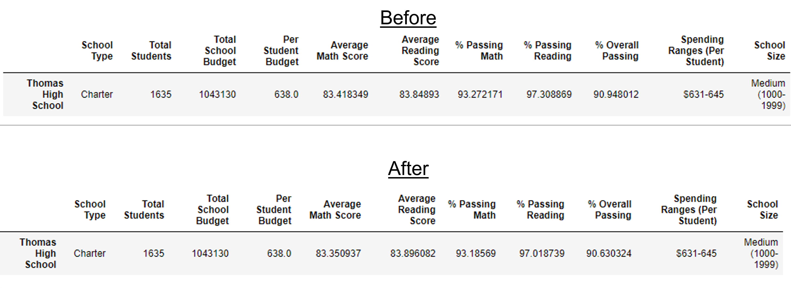
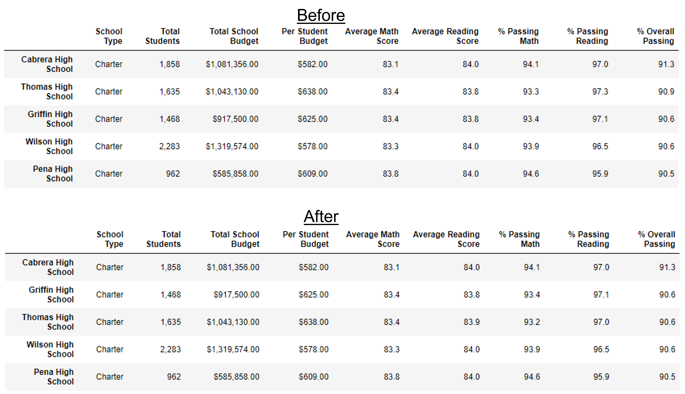

# school-district-analysis
Data Analysis Bootcamp - Week 4

## Overview

For this project, we were tasked with looking at data for an entire school district and coming up with a number of summaries to see how the schools are performing. We were given two csvs, one containing information about the schools in the district, and another containing information about the students and their grades. A rundown of the deliverables requested is pasted below:

> Deliverables:
> - A high-level snapshot of the district's key metrics, presented in a table format
> - An overview of the key metrics for each school, presented in a table format
> - Tables presenting each of the following metrics:
>     - Top 5 and bottom 5 performing schools, based on the overall passing rate
>     - The average math score received by students in each grade level at each school
>     - The average reading score received by students in each grade level at each school
>     - School performance based on the budget per student
>     - School performance based on the school size 
>     - School performance based on the type of school

Additionally, we were warned that there was evidence of academic dishonesty and that we needed to replace all the math and reading grades with null values for the ninth graders in Thomas High School in order to keep that from misrepresenting any of our statistics.

## Resources:

- Data Sources: [schools_complete.csv](Resources/schools_complete.csv), [students_complete.csv](Resources/students_complete.csv)
- Software: Python 3.7.13, Jupyter Notebook 6.4.8

## Analysis

I worked this analysis in a Jupyter Notebook file, writing in Python, and largely relied upon the Pandas library. We loaded in the school and student csvs into separate data frames and then merged them together on the "school_name" column to create one working data frame with all the information we'll need. The results below will focus on the differences between the tables we calculated throughout the lesson module and the updated tables we calculated for the challenge, taking into account the removal of Thomas High School ninth graders from the dataset.

## Results

- How is the district summary affected?
    - The changes here are a little subtle. As expected, the total schools, total students, and total budget columns stayed the same. The average math score dropped from 78.99 to 78.93 and the average reading score dropped from 81.88 to 81.86. Similarly, the math passing percentages dropped from 74.98% to 74.76%, the reading passing percentages dropped from 85.81% to 85.66%, and the overall passing rates dropped from 65.17% to 64.86%. You would expect one grade of one school to have a relatively small effect on the district-wide stats in a district of 15 schools with four grade levels each, so these results aren't too surprising. 

- How is the school summary affected?
    - The change is a little more visible here. The average math score dropped from 83.42 to 83.35 and the average reading score actually raised from 83.85 to 83.90. The math passing percentages dropped from 93.27% to 93.19%, the reading passing percentages dropped from 97.31% to 97.02%, and the overall passing rates dropped from 90.95% to 90.63%. As you can see, Thomas High School is already a very high performing charter school, with 91% passing once the ninth graders are removed. Below is an image of the School Summary data frame, showing these differences before and after. I saved them in unformatted form so you can see multiple decimal places in the averages and percent passing columns in order to pick up on the changes.

- How does replacing the ninth graders' math and reading scores affect Thomas High School's performance relative to the other schools?

    - This is the table where the changes are most obvious. In the initial pass of building these tables Thomas High School was in a comfortable second place, with an overall passing rate of 90.95%. Once the ninth graders were removed from the statistics and the overall passing rate was recalculated Thomas High School moved in line with Griffin High School and Wilson High School, all of whom have overall passing averages that round off to 90.6%. While Thomas still technically has the highest passing percentage at 90.63%, if you sort the table just based on the rounded off values, this can make it look like Thomas High School has moved into third place and regardless of how you sort it, it's now in the same pack with the other two schools instead of having a comfortable lead. A screenshot of the formatted tables is shown below, to show Thomas High School's movement down into the pack of schools in the middle of the top 5.

- How does replacing the ninth-grade scores affect the following:
    - Math and reading scores by grade: all the numbers stay the same, except for the 9th grade column in the Thomas High School row, which has now become "nan"
    - Scores by school spending: there was some small movement in the deeper decimal places for the category Thomas High School belonged to, but not enough to affect the final formatted table with numbers rounded off
    - Scores by school size: same as above
    - Scores by school type: same as above

- Summarize four changes in the updated school district analysis after reading and math scores for the ninth grade at Thomas High School have been replaced with NaNs.
    - Thomas High School now fits in with the middle of the "Top 5" schools as opposed to having a comfortable second place.
    - The small changes in passing rates along with the slight rise in the reading scores lead me to believe that the academic dishonesty was either not widespread, was filled with people only bumping their grades up to a passing point and not any higher to avoid suspicion, was done by deliberately trying to track ninth grade scores with school-wide averages, or some mix of all of the above. Glad to have it out of the system, but I wouldn't have been able to notice anything was off without the heads up.
    - In the reading and math scores by grade tables, Thomas High School has a non-numeric "nan" value in the 9th grade columns. This would be enough for someone who didn't know the story to infer that there is something more to that school's story.
    - There was little change in the district wide and school spending/size/type tables. This is to be expected since each of those is an aggregate of multiple schools with 4 grades each and one grade of one school should have a fairly small effect anyway.